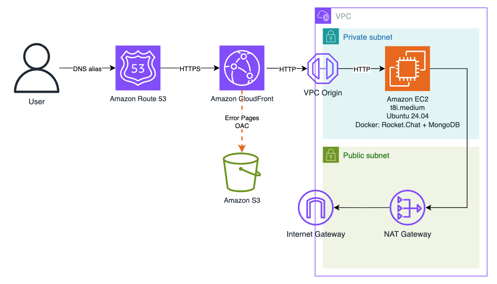

# 🚀 Ephemeral Rocket.Chat on AWS

イベント当日だけ使う Rocket.Chat を、EC2 + CloudFront VPC オリジンで立てるための CloudFormation 一式です。**イベント後は全スタックを削除**してください（下記「後片付け」）。

## アーキテクチャ



- Amazon Route 53
  - 名前解決と ACM 証明書発行に利用します
- Amaazon CloudFront
  - Amazon EC2 と Sorry Page のメンテナンス画面を配信します
- CloudFront VPC Origin
  - HTTP:80 でプライベートサブネットに起動した EC2 に接続します
- Amazon EC2
  - 最新の t8i インスタンスを採用しました
  - Rocket.Chat と MongoDB を稼働させます
- NAT Gateway
  - Rocket.Chat の Docker イメージ取得などのためインターネット接続を提供します
  - セットアップ完了後に削除できます
- Amazon Route 53 と AWS Certificate Manager
  - 独自ドメインを利用する際に使います (オプション)

## セットアップ手順

セットアップ時のみ NAT Gateway が必要です。  
セットアップが終わったら、NAT Gateway は削除できます。

```
やること

1. CloudFormation の 3 スタックを流す
2. Rocket.Chat をセットアップする
3. NAT Gateway を削除する
4. Error ページを編集して S3 にアップロードする

[オプション] 独自ドメインをつけたい場合は、別途、ドメインとホストゾーンが必要です。

5. Route 53 に CloudFront のエイリアスレコードを設定
6. ACM 証明書を発行
7. CloudFront に Route 53 レコードを手動で紐づけ

Rocket.Chat をセットアップして NAT Gateway を削除し、サーバーを止める

8. Rocket.Chat に、匿名書き込みを許可するなどのセットアップをする
9. rocket.sh を使ってサーバーを止める
```

### そのほか留意事項

- **リージョン**は、`us-east-1` を利用します
- EC2 はプライベートサブネットに起動します
- CloudFront VPC Origin をデプロイします
- CloudFront マネージドプレフィックスリスト `com.amazonaws.global.cloudfront.origin-facing` で制限しているので、CloudFront のみ 80 番に到達可能です
  - VPC Origin への inbound 許可には 2 通りあります
  - (1) このマネージドプレフィックスリストを許可する方法と、(2) VPC Origin 作成後に自動生成される CloudFront のサービス管理 SG `CloudFront-VPCOrigins-Service-SG` を許可する方法です
  - 本構成は **(1) を採用** しています。
  - (2) は「自分の distribution からのみ」に絞れてより限定的ですが、**SG が VPC Origin 作成後にしか存在しない**ため 1 スタックで完結させにくく、デプロイ順に依存しない (1) を選びました
- SSH が必要なときだけ **EC2 Instance Connect Endpoint (EIC Endpoint)** 経由で接続します
- EIC Endpoint は追加料金がかかりません
- SSM の VPC エンドポイントは課金を回避するために **使いません**。
- NAT ゲートウェイは **別スタック** にしました
- Docker イメージ取得後に削除して課金を止める想定です
- Rocket.Chat のバージョンは、現行最新の 8.9.0 を採用しました
- Rocket.Chat 8.x に必要な MongoDB をデプロイします
- Node.js 24 が同梱されます

### スタック構成とファイル

| 順序 | ファイル | 役割 | 寿命 |
|---|---|---|---|
| 1 | `01-network.yaml` | VPC・サブネット・IGW・ルートテーブル・EIC Endpoint・SG | 常設（安価） |
| 2 | `02-nat.yaml` | NAT Gateway + EIP + プライベート RT への既定ルート | **使い捨て**（高額） |
| 3 | `03-app.yaml` | EC2 (Rocket.Chat) + CloudFront (VPC Origin) + S3 (Sorry ページ) | イベント期間 |
| - | `error.html` | 停止中に表示する準備中ページ（S3 にアップロード） | - |

`ProjectName` パラメータ（既定 `ephemeral-rocketchat`）は 3 スタックで **同じ値** を使ってください。スタック間は Export/ImportValue で連携します。

---

## やること詳細 - デプロイ手順

まず、CloudFormation の 3 スタックを流します。  
事前確認として `aws sts get-caller-identity` が通ること、リージョンが `us-east-1` であることを確認してください。

### 1-1. ネットワークスタックを流す

01-network.yaml を CloudFormarion に流します。

```bash
aws cloudformation deploy \
  --region us-east-1 \
  --stack-name ephemeral-rocketchat-network \
  --template-file 01-network.yaml \
  --capabilities CAPABILITY_IAM
```

> `01-network.yaml` は CloudFront のオリジン向けプレフィックスリスト ID を解決する小さな Lambda（カスタムリソース）を含むため `CAPABILITY_IAM` が必要です  
> `EC2 Instance Connect Endpoint` の作成に時間がかかります

### 1-2. NAT スタックを流す

NAT Gateway がデプロイされ、プライベートザブネットがインターネットに接続できるようになります。

```bash
aws cloudformation deploy \
  --region us-east-1 \
  --stack-name ephemeral-rocketchat-nat \
  --template-file 02-nat.yaml
```

> これをデプロイしないと、`03-app-yaml` 実行時に、Rocket.Chat のデプロイに失敗します。
> Rocket.Chat のセットアップが完了したら、削除できます。

### 1-3. アプリスタックを流す

EC2 や CloudFront などがデプロイされます。

```bash
aws cloudformation deploy \
  --region us-east-1 \
  --stack-name ephemeral-rocketchat-app \
  --template-file 03-app.yaml \
  --capabilities CAPABILITY_IAM \
  --parameter-overrides RootUrl=https://chat.example.com
```

- `UbuntuAmiId` は SSM パラメータで最新の Ubuntu 24.04 を自動解決します  
- `RocketChatVersion` や `RootUrl` を変えたいときは `--parameter-overrides Key=Value` を付けてください  
- CloudFront ディストリビューションと VPC オリジンのデプロイは **最大15分** ほどかかります

### 2. Rocket.Chat をセットアップする

アプリスタックを作成した後、EC2 内で Docker が起動するまで数分かかります。  
確認したいときは EIC Endpoint 経由で SSH してください。

```bash
# InstanceId はアプリスタックの出力に出る
INSTANCE_ID=$(aws cloudformation describe-stacks \
  --region us-east-1 --stack-name ephemeral-rocketchat-app \
  --query "Stacks[0].Outputs[?OutputKey=='InstanceId'].OutputValue" --output text)

aws ec2-instance-connect ssh --region us-east-1 --instance-id "$INSTANCE_ID"
# 接続後:
sudo docker compose -f /opt/rocketchat/compose.yml ps
sudo docker compose -f /opt/rocketchat/compose.yml logs -f rocketchat
```

Rocket.Chat が `Server is running on port 3000` 相当のログを出せば OK です。  
Rocket.Chat を最初に開くと、管理者を登録するウィザードが開きます。  
メールアドレスが必要です。

### 3. NAT Gateway を削除する

Docker イメージの取得が終われば、NAT の課金を止めれます。  
外形からは Rocket.Chat のセットアップ画面が表示されたことが確認できれば問題ありません。  
CloudFormation スタックを削除してください。

EC2・CloudFront はそのまま動き続けます。プライベートサブネットからの外向き通信だけが止まるイメージです。

```bash
aws cloudformation delete-stack --region us-east-1 --stack-name ephemeral-rocketchat-nat
```

> 注意: NAT を落とすと Rocket.Chat の外向き通信 （cloud.rocket.chat 登録、モバイルプッシュ通知ゲートウェイ、外部 URL プレビューなど） が使えなくなります。
> チャット自体のデモには影響しません。再び必要になったら `02-nat.yaml` を再デプロイすればルートが復活します。

### 4. Error ページを編集して S3 にアップロードする

Error ページは、`error.html` です。  
XXX などのフレーズを適宜修正して、S3 バケットにアップロードしてください。  

```bash
BUCKET=$(aws cloudformation describe-stacks --region us-east-1 \
  --stack-name ephemeral-rocketchat-app \
  --query "Stacks[0].Outputs[?OutputKey=='ErrorPageBucketName'].OutputValue" --output text)

echo $BUCKET

aws s3 cp error.html "s3://$BUCKET/error.html" \
  --content-type "text/html; charset=utf-8"
```

### 5. Route 53 に CloudFront レコードを手動で紐づける
[オプション 作業]

スタックのデプロイが終わったら、Route 53 レコードを登録して、手作業にて独自ドメインを設定できます。  
CloudFront はまず　**デフォルトドメイン（`xxxx.cloudfront.net`）のみ**　で立ち上がるため、ここに独自ドメインと証明書を手で足します。

Route 53 にドメインを登録します。Route 53 にホストゾーンが登録されます。  
ホストゾーンに、レコードを登録します。  
登録するレコードは以下の通りです。

- Route 53 ホストゾーンを開き、レコード（例: example.com.）を追加する
  - エイリアスレコードのトグルを ON にする
  - CloudFront を選択する
  - CloudFront の DNS を登録する

> 独自ドメインが不要な方は、本作業をスキップして、手順 8 に進んでください

### 6. ACM 証明書を発行
[オプション]

AWS Certificate Manager (ACM) を利用することで、独自ドメインに HTTPS 通信を実装できます。  
手順は以下の通りです。

- ACM を開く
- バージニア北部リージョンの管理コンソールが開いていることを確認して証明書を登録する
  - 先の手順で Route 53 に登録したレコード（例: example.com）を入力して、発行する
  - エクスポート機能は有効にしない（コストがかかります）
  - Route 53 に CNAME レコードへの書き込みを行う
- ステータスが検証済みになることを確認する

### 7. CloudFront に Route 53 レコードを手動で紐づけ
[オプション]

最後に、CloudFront にカスタムドメインを設定したら独自ドメイン設定の作業は完了です。

- CloudFront の一般タブにある [編集] ボタンをクリックする
- Alternative domain name (CNAMEs) - optional に 4 の手順で発行したレコードの DNS 名を入れる (例: example.com)
- Custom SSL certificate - optional に 5 の手順で発行した ACM レコードを設定する
- [変更を保存] ボタンをクリックする

### 8. Rocket.Chat に、匿名書き込みを許可するなどのセットアップをする

ハンズオンイベントなどで Rocket.Chat を複数名で利用する場合、以下の設定変更を検討する必要があります。

#### ログイン不要にする

初期設定では、ログインが必要です。管理者画面から設定を変更することでログインなしでチャットを利用できます。  

- 管理者アカウントで Rocket.Chat にログインする
- Manage → Workspace → Settings → Accounts に進む
- Allow Anonymous Read を ON にすると、ログインせずに公開チャンネルを閲覧できる
- Allow Anonymous Write	を ON にすると、ログインせずに公開チャンネルへ投稿できる

#### Rate Limiter （リクエスト数制限） を解除する

Rocket.Chat には、短時間に大量のリクエストが発生することを防ぐ仕組みがあり、会場の Wi-Fi から一斉にアクセスしたりして制限に達すると、リクエストが拒否される場合があります。  
Rate Limiter を解除することで全員が囲めるようになります。

- 管理者アカウントで Rocket.Chat にログインする
- Manage → Workspace → Settings → Rate Limiter に進む
- 以下の値を調整する
  - API Rate Limiter で、API リクエストの制限ができます
  - Limit by IP	で、同一 IP アドレスからのリクエストを制限できます
  - Limit by Connection で、接続単位の制限ができます
  - Limit by User で、ユーザー単位の制限ができます
- CloudFront からの接続が

まずは設定値を記録し、制限に達していないか確認することをおすすめします。

### 9. rocket.sh を使ってサーバーを止める

セットアップが完了したら、イベント開始までインスタンスを停止しておくことができます。  
停止中も S3 バケットに登録した error.html ページに Sorry 遷移し、継続してイベントを告知できます。

- `aws sts get-caller-identity` コマンドを利用して、対象のアカウントと認証に差異がないことを確認する
- `./rocket.sh stop` を実行する

イベントを開始する場合は、start を実行してください。

- `./rocket.sh start` を実行する

`stop` を実行すると、メンテナンス状態になります。  

- EC2 インスタンスを停止する
- CloudFront に `/*` ビヘイビア（S3 オリジン `errorpage-s3-origin`）が追加される
- このビヘイビアの **viewer-request に CloudFront Function がアソシエーション** される
- Cloud Function は、**あらゆる URI を `/error.html` に書き換える**
- 結果、`/` だけでなく `/channel/general` のような任意パスでも準備中ページに遷移する
- S3 の静的コンテンツを配信するため EC2 が停止していてもページが表示される

> なぜ Function が要るのか: キャッシュビヘイビアは「どのオリジンへ送るか」を決めるだけで URI は書き換えません。また `DefaultRootObject` は `/` へのリクエストにしか効かず、`/channel/general` のようなサブパスには適用されません（AWS 公式ドキュメントでも明記）。そのため以前の「`/*` を S3 へ向け + `DefaultRootObject=error.html`」という構成では、任意パスが S3 の存在しないオブジェクトを取りに行ってエラーになり得ました。viewer-request Function で URI を `/error.html` に書き換えることで、どのパスでも確実に準備中ページを返します。

> `502/503/504` のカスタムエラーレスポンス（S3 の `error.html` を `200` で返す）は**バックストップ**として残しています。`/*` の切り替えが主、エラーレスポンスは保険、という二段構えです。

## ⚠️ 重要: アプリを再デプロイするとカスタムドメインが外れる

[オプション] のカスタムドメインを設定した場合、`03-app.yaml` のテンプレートを再実行すると、CloudFormation が「テンプレートに無い設定＝不要」と判断して、手動で足した **代替ドメイン名と証明書を削除**します。結果、設定した独自ドメインにアクセスできなくなります。

**対策（どちらか）:**

- **(推奨) 手動設定をテンプレートに取り込む** — `03-app.yaml` の `DistributionConfig` に以下を追記してから `deploy` する。こうすればテンプレートと実態が一致し、再 deploy しても崩れない。

  ```yaml
  # DistributionConfig: の中に追加
  Aliases:
    - chat.example.com
  ViewerCertificate:
    AcmCertificateArn: arn:aws:acm:us-east-1:123456789012:certificate/xxxxxxxx-xxxx-xxxx-xxxx-xxxxxxxxxxxx
    SslSupportMethod: sni-only
    MinimumProtocolVersion: TLSv1.2_2021
  ```

  証明書 ARN は次で確認:

  ```bash
  aws acm list-certificates --region us-east-1 \
    --query "CertificateSummaryList[?DomainName=='chat.example.com'].CertificateArn" \
    --output text
  ```

- **(非推奨) テンプレートを再 deploy しない** — 以降の変更も全部コンソールで手動対応する。IaC から外れるので管理が煩雑になる。

> 現状、S3 エラーページ（下記）を反映するには 03 の再 deploy が必要です。**先に上記の `Aliases` / `ViewerCertificate` をテンプレートへ取り込んでから** deploy してください。

## 後片付け（イベント終了後）

**作成と逆順**で削除します。削除し忘れると EC2・CloudFront・（残っていれば）NAT の課金が続くので、当日中に実施してください。

```bash
# 0. S3 エラーページバケットを空にする（空でないとアプリスタック削除が失敗する）
BUCKET=$(aws cloudformation describe-stacks --region us-east-1 \
  --stack-name ephemeral-rocketchat-app \
  --query "Stacks[0].Outputs[?OutputKey=='ErrorPageBucketName'].OutputValue" --output text)
aws s3 rm "s3://$BUCKET" --recursive

# 1. アプリ（EC2 + CloudFront + S3）
aws cloudformation delete-stack --region us-east-1 --stack-name ephemeral-rocketchat-app
aws cloudformation wait stack-delete-complete --region us-east-1 --stack-name ephemeral-rocketchat-app

# 2. NAT（まだ残っていれば）
aws cloudformation delete-stack --region us-east-1 --stack-name ephemeral-rocketchat-nat
aws cloudformation wait stack-delete-complete --region us-east-1 --stack-name ephemeral-rocketchat-nat

# 3. ネットワーク
aws cloudformation delete-stack --region us-east-1 --stack-name ephemeral-rocketchat-network
```

手動で作ったものも忘れずに削除してください:

- Route 53: `chat`（`chat.example.com`）の A(エイリアス) レコード、および ACM の CNAME 検証レコード
- ACM: 発行した証明書（us-east-1）

> ネットワークスタックの削除は、アプリスタック削除で CloudFront の VPC オリジン用 ENI が消えてからでないと失敗することがあります。上記の順序（app → nat → network）と `wait` を守ってください。

---

## 補足メモ

- `t8i.medium` は 2 vCPU / 4 GiB。Rocket.Chat + MongoDB の最小ラインです。
- サブネットは AZ **名**（`us-east-1a` / `us-east-1b`）を既定にしていますが、これは出発点にすぎません。CloudFront VPC オリジンが非対応なのは AZ **ID** が `use1-az3` の AZ です。AZ 名（`us-east-1a` など）と AZ ID（`use1-az1` など）の対応は**アカウントごとに異なる**ため、名前だけでは `use1-az3` かどうか判断できません（[AWS: AZ ID について](https://docs.aws.amazon.com/ram/latest/userguide/working-with-az-ids.html)）。デプロイ前に自分のアカウントの対応を確認し、`use1-az3` に割り当たっていない AZ 名を `01-network.yaml` の `AzA` / `AzB` に指定してください:

  ```bash
  aws ec2 describe-availability-zones --region us-east-1 \
    --query "AvailabilityZones[].[ZoneName,ZoneId]" --output table
  # ZoneId が use1-az3 の行の ZoneName を避けて、2つの ZoneName を選ぶ
  ```
- 検証コマンド: `cfn-lint -r us-east-1 -i W1030 -- 01-network.yaml 02-nat.yaml 03-app.yaml`
  （`W1030` は cfn-lint の内蔵スペックが新しい `t8i` を未収録なだけの誤検知。EC2 API で実在を確認済み。）
